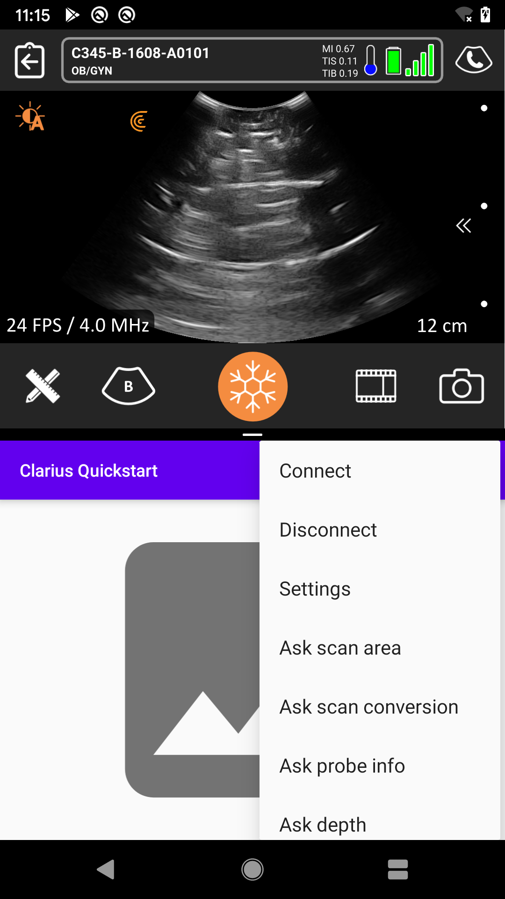
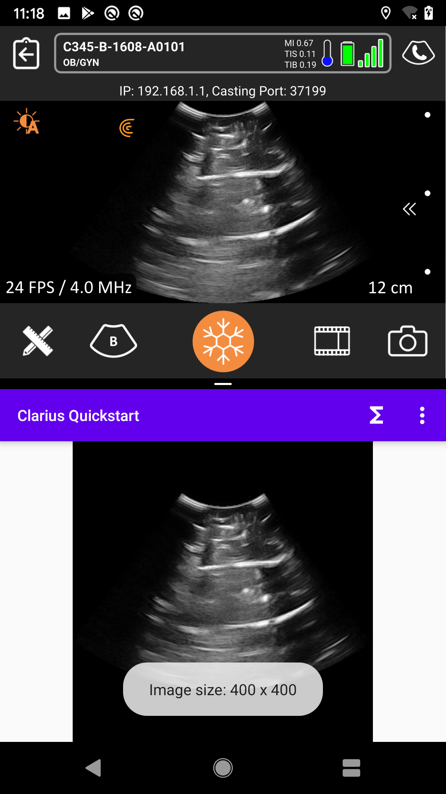

Clarius Mobile API
==================

The Mobile API allows third party applications to obtain images produced by a Clarius Ultrasound Scanner in real time.
It also supports sending user commands such as changing the imaging depth or taking a capture.

# Prerequisites

- [Clarius Ultrasound Scanner](https://clarius.com/)
- [Clarius App for Android](https://play.google.com/store/apps/details?id=me.clarius.clarius)
- A valid Mobile API license (managed per scanner)

Note: Virtual scanners are supported without a license since version 8.0.1.

# SDK reference

https://clariusdev.github.io/mobileapi/reference/9.4.0

# Get the package

Starting with Clarius App version 9.4.0, the Mobile API is distributed as an Android package.
The package is hosted in the GitHub Gradle registry which requires authentication (a GitHub account is needed).

1. Generate a GitHub Personal Access Token (PAT) with the `read:packages` scope.
Refer to the [GitHub documentation][github-pat] for instructions to generate tokens.

1. Create a file `secrets.properties` in the project's root folder (which will be read by the Gradle build script) with the following content:

        // file /secrets.properties
        // do not put quotes (') around the values 
        gpr.user=your_user_name
        gpr.token=personal_access_token_with_read_packages_scope

3. Alternatively, if the secrets file is missing, the build script will attempt to read the environment variables `GITHUB_ACTOR` and `GITHUB_TOKEN`.

[github-pat]: https://docs.github.com/en/authentication/keeping-your-account-and-data-secure/creating-a-personal-access-token
[github-gradle]: https://docs.github.com/en/packages/working-with-a-github-packages-registry/working-with-the-gradle-registry#using-a-published-package

# Quick start

1. On your Android device, start the Clarius App and connect to your scanner.

2. Open this project in Android Studio and run the example application on your Android device.

3. Optional: run both applications in split screen, otherwise let the Clarius App run in the background.

4. In the example application, select Menu `⋮` > `connect` to start receiving images.

Usage:

* Function menu `∑`: configure imaging like depth, gain or ultrasound mode.

* Menu `⋮` > `Ask *`: obtain imaging information, like the current depth or gain.

* Menu `⋮` > `settings`: configure the image rendered by the Clarius App and sent over the API.

# Architecture

The Mobile API communicates with the _Clarius App_ instead of the ultrasound scanner directly (as is the case when using the Cast API).
Therefore, the Clarius App must be installed and running on the same Android device.
The Clarius App takes care of connecting to the probe and pre-processing the images before serving them through the API.

                            +-----------------------+
                            |    Android Device     |
                            |                       |
    +---------+             |    +-------------+    |
    |         |   Images    |    |             |    |
    |  Probe  +----------------->+ Clarius App |    |
    |         | (via Wi-Fi) |    |             |    |
    +---------+             |    +-------------+    |
                            |    | Mobile API  |    |
                            |    +----+---+----+    |
                            |         |   ^         |
                            |   Images|   |Commands |
                            |         v   |         |
                            |    +----+---+----+    |
                            |    |  3rd Party  |    |
                            |    |     App     |    |
                            |    +-------------+    |
                            |                       |
                            +-----------------------+

# API Description

On Android, the Mobile API is implemented as an Android _Bound Service_ running in the Clarius App itself.
Refer to the [Android developer guide](android-bound-services) for details about bound services.

The interface to the bound service is provided by an Android _Messenger_.
Android Messengers allow interprocess communications (IPC) by exchanging `Message` objects containing an action code and a payload.
The sequence of messages and their content constitute the communication protocol which is described below.

[android-bound-services]: https://developer.android.com/guide/components/bound-services

# Protocol

1. The client binds to the service by calling `Context.bindService()` and receives the server's `IBinder`.
This `IBinder` is used to create a Messenger that can send messages _to the server_.
2. The client sends its own Messenger to the server in the `replyTo` field of a `Message` object with code `MSG_REGISTER_CLIENT`.
This Messenger is used by the server to send messages _to the client_.
3. The client sends the image configuration to the server (`MSG_CONFIGURE_IMAGE`).
4. During operation, the server will send the image data to the client (`MSG_NEW_PROCESSED_IMAGE`) and other notable events such as button presses, freeze state, etc.
5. The client can request the execution of predefined functions such as "increase depth" or "capture image" (`MSG_USER_FN`).

All messages and their associated payload are described in the https://clariusdev.github.io/mobileapi repository.

# Licensing

The service operates only when the Clarius App is connected to a scanner with the appropriate license.
Contact Clarius for licensing options: https://clarius.com/contact/.

However, the service accepts binding requests from clients even when no proper license is active to accommodate workflows where the license is removed for legitimate reasons, for example when a probe is disconnected to save battery.
In this case, the service enters a restricted mode where it stops handling requests and sending updates, but will resume normal operation as soon as a licensed scanner is connected again.

The license check workflow is as follows:

1. The client binds to the service
2. The service starts and accepts the bind request, regardless of the license status
3. Depending on the current license status:
    - if active, the service operates normally: all client requests are handled and all updates are sent to the clients
    - if inactive, the service enters restricted mode: no update is sent (except `MSG_LICENSE_UPDATE`) and no client request is handled (except `MSG_REGISTER_CLIENT` and `MSG_UNREGISTER_CLIENT`). The service will reply `MSG_NO_LICENSE` to any other request
4. If the license status changes during operation, the service sends `MSG_LICENSE_UPDATE` and changes its mode of operation:
    - if the license becomes inactive: the service clears the image configuration and enter restricted mode
    - if the license becomes active: the service resumes normal operations, but the client must re-send the image configuration

# Raw Data

Workflow to obtain raw data:

1. Activate raw data acquisition on the probe, see https://github.com/clariusdev/raw for instructions
2. Make a capture from the Clarius App, this will trigger the following actions:
    - download the raw data and store it in the examination data
    - clear the probe's buffer
    - notify the client with `MSG_RAW_DATA_AVAILABLE`
3. In the client, send `MSG_COPY_RAW_DATA` to request a copy, include the following data:
    - the capture's identifier and
    - and a writable URI where the archive will be written, refer to the [Android developer guide](android-file-sharing) for details about file sharing
4. In the client, wait for the reply in message `MSG_RAW_DATA_COPIED`

Note: it is possible to trigger a capture via the Mobile API with `MSG_USER_FN`.

[android-file-sharing]: https://developer.android.com/training/secure-file-sharing
